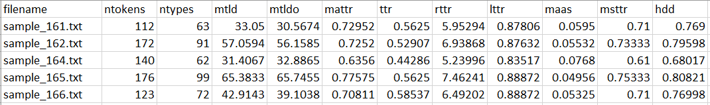

## Korean LExico-Grammatical Analyzer (KLEGA)

A Korean lexical diversity analyzer with following features:
- Remove typos from the raw texts automatically
- Tokenize using one of the six tokenizers (okt, komoran, mecab, kkma, hannanum from [konlpy](https://konlpy.org/en/latest/), [stanza](https://stanfordnlp.github.io/stanza/tokenize.html))
- Calculate lexical diversity using the package [taaled](https://github.com/kristopherkyle/TAALED)
- Analyze with and without function words


## Setup
Currently, the execution of the code is available only on Windows environment with Microsoft Office installed. (Microsoft Office is needed to remove typos from the raw text.)  

### Basic setup
Install the required packages using:
```angular2html
pip install -r requirements.txt
```

### Mecab tokenizer installation (optional)
Manual installation is needed to use the mecab tokenizer on Windows. 
Follow this instruction to install Mecab: [Korean](https://uwgdqo.tistory.com/363), [English(translated)](https://uwgdqo-tistory-com.translate.goog/363?_x_tr_sl=ko&_x_tr_tl=en&_x_tr_hl=ko&_x_tr_pto=wapp
)  

Default Mecab path in the source code is set to: 'C:/mecab/mecab-ko-dic'  
You can change the path in the source code directly if you installed Mecab in different path:  
https://github.com/hksyir/klega_lexdiv/blob/2e0d1a8b8bf03abfdbce62d445ce03d7a45fcf09/src/korean_tokenizer.py#L65


## Data (Input)
The Korean texts (input data) for analyzing the lexical diversity must be in plain text files with the extension ```.txt```.
You can process multiple files, which are stored in one ```data``` directory.  
e.g. ```data/text1.txt``` ```data/text2.txt``` ```data/text3.txt```


## Usage
For the basic usage, run:
```angular2html
python src/main.py -i [INPUT_DIR]
```
This will process your texts in your ```INPUT_DIR``` using (default) ```okt``` tokenizer and save the output in the ```result``` directory, processing contents words only, without parallel analysis. 
```[INPUT_DIR]``` must be a directory where all the text files to process are stored.  

### Tokenizers
To choose different tokenizers, use the argument ```-t```. You can process the same input multiple times using different tokenizers. E.g. To use ```okt``` and ```mecab```, run this command:
```angular2html
python src/main.py -i [INPUT_DIR] -t okt mecab
```
Currently available tokenizers are: ```okt``` ```mecab``` ```hannanum``` ```komoran``` ```kkma``` ```stanza```

### Processing functional words
To process functional words as well (contents words and functional words), add ```-f``` flag in the command:
```angular2html
python src/main.py -i [INPUT_DIR] -f
```
Note: For ```stanza``` tokenizer, ```-f``` must be always added. ```stanza``` does not have an option to extract content words only.

### Parallel analysis
To do parallel analysis, add ```-p``` flag in the command:
```angular2html
python src/main.py -i [INPUT_DIR] -p
```

### Run with all options
If you want to experiment with all setups (processing functional words Y/N and parallel analysis Y/N), run this command with the flag ```-a```:
```angular2html
python src/main.py -i [INPUT_DIR] -a
```
This will use the default ```okt``` tokenizer to run all the options.  
You still need to specify tokenizers you want. If you want to run with all (currently) available tokenizers, run this:
```angular2html
python src/main.py -i [INPUT_DIR] -a -t okt mecab hannanm komoran kkma stanza
```

### Changing output directory
The default output directory is ```result```. If you want to change the output directory, use the flag ```-o```:
```angular2html
python src/main.py -i [INPUT_DIR] -o [OUTPUT_DIR]
```

### Example usage
If you want to process the files in the directory ```input``` using the tokenizer set ```hannanum``` and ```komoran```, doing parallel analysis, processing contents words only, and save the output to the directory ```output```:
```angular2html
python src/main.py -i input -o output -t hannanum komoran -p
```

## Result (Output)
Three kinds of output files are saved after a successful run. 
### Logfile   
The log file ```log_[yymmdd]_[hhmm].log``` shows the configuration of your run, e.g. selected tokenizer, processed files, etc.
### Processed Files
The tsv file ```processed_data.tsv``` includes raw texts (column ```raw```), list of typos removed (column ```typo```) and processed texts (column ```processed```) to tokenize and calculate lexical diversity. This file is useful when you want to reuse the processed texts for other text manipulation or evaluation.
### Lexical Diversity Values
The list of lexical diversity values are stored as a tsv format in the file ```[TOKENIZER]_[FUNCTION_WORD_OPTION]_[PARALLEL_ANALYSIS_OPTION].tsv```.
E.g. the configuration of the output file ```stanza_all_words_prll.tsv``` is ```stanza```, including function words with parallel analysis. ```hannanum_content_only.tsv``` is the output when you processed with ```hannanum```, without function words, without parallel analysis.  
This is an example result file:



## Web Demo
A [web demo version](http://sooyeoncho.pythonanywhere.com) of Korean LExico-Grammatical Analyzer KLEGA is available now.  
Currently optimized for the Chrome browser on PC. (under development)


### To be updated
- [ ] analyze without typo removal option (for running on the other OS)

Please create a GitHub issue if you have any questions or bug-reports.  
Email to the writers: [Sooyeon Cho](mailto:sooyeon.cho@uzh.ch) & [Hakyung Sung](mailto:hsung@uoregon.edu)